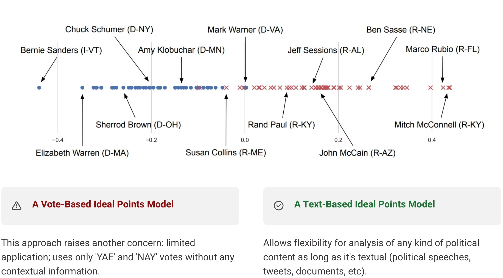



Measuring Political Subjectivity And Polarizations

{: .fs-5 .fw-700 .text-delta}

`POLITICS` is meant to help someone who is interested in voting activities understand the political leaning of a candidate for federal elections through quantitative measures and data-driven procedures.

---

Issue

{: .fs-4 .fw-700}

Sometimes a piece of political discourse could be very complicated and hard to decipher. And often human interpretation tends to be subjective and biased" (Chilton, 2004; van Dijk, 2000).

Important Context

{: .fs-4 .fw-700}

Understanding the types of political polarizations is crucial in today's increasingly divided political landscape. Political polarization can manifest in various forms, such as ideological, partisan, and affective polarization, each influencing public discourse, policy-making, and voter behavior differently.

Ideological polarization refers to the divergence of political attitudes to ideological extremes, while partisan polarization signifies the growing division between political parties (Pew Research Center, 2014) . Affective polarization, on the other hand, pertains to the extent of negative emotions and animosity between members of different political groups (Iyengar & Westwood, 2015) .

<!-- 

Types of Polarization

{: .fs-4 .fw-700} -->

<!--  -->

Solution

{: .fs-4 .fw-700}

Recognizing these distinctions is essential for accurately interpreting political behaviors and trends (Fiorina & Abrams, 2008) . This project, therefore, aims to offer an objective solution to addressing these complexities: by dynamically measuring the stance of politicians using advanced statistical modeling methods, specifically the families of Variational Autoencoders, we can quantify their political leanings.

This approach not only enhances our understanding of individual political positions but also contributes to a more nuanced comprehension of the broader dynamics of political polarization (Barberá, 2020). The provision of the method could, in hope, reduce the obstacles when it comes to understanding politics, potentially help the general public understand what they are looking at, and facilitate the voting processes.

Method

{: .fs-4 .fw-700}

1. A one-dimensional space onto which the author's political stance ("ideological topics") is projected as an ideal point.

2. Without the aid of any labels or preconceived political information, the solution could still separate
the authors by parties and relevant politicized topics.

References

{: .fs-4 .fw-700}

Chilton, Paul. Analyzing Political Discourse: Theory and Practice. Routledge, 2004.

van Dijk, Teun A. Ideology and Discourse: A Multidisciplinary Introduction. Pompeu Fabra University, 2000.

King, Gary. How Not to Lie with Statistics: Avoiding Common Mistakes in Quantitative Political Science. American Journal of Political Science, 2013.
\\
\\
Blei, David M., Alp Kucukelbir, and Jon D. McAuliffe. Variational Inference: A Review for Statisticians. Journal of the American Statistical Association, 2017.
